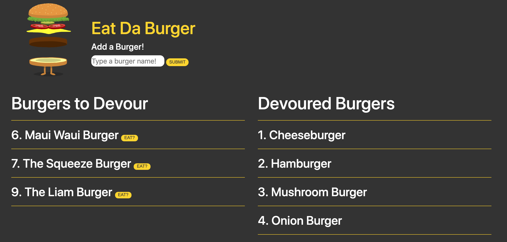

# Eat Da Burger

Eat Da Burger is a full stack application that uses Node, Express, Handlebars, and MySQL to add burgers to an online database and eat them later (kind of).

Check out the application in action here: https://rocky-basin-41679.herokuapp.com/

Add any kind of burger you want to the list and then simply push a button to devour it (kind of).

*You'll have to make the burger at home if you actually want to devour it.